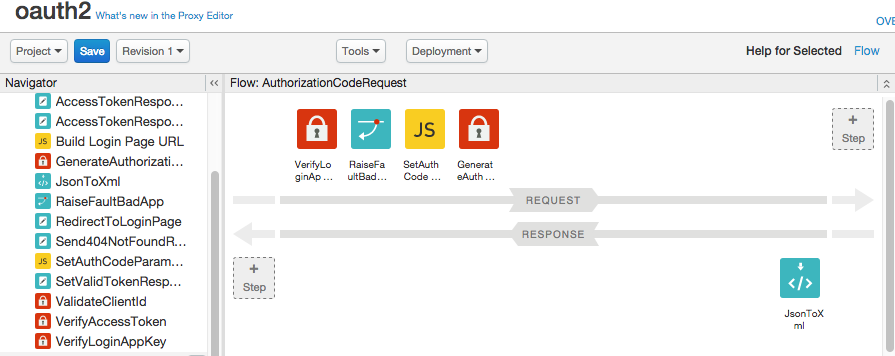

# Apigee Edge sample API proxies

* [Audience](#who)
* [Intro](#intro)
* [Before you begin](#before)
* [Using the sample proxies](#using)
* [Setting up](#initial)
* [Deploying a sample proxy](#deploying)
* [Invoking a sample proxy](#invoking)
* [Modifying a sample proxy](#modifying)
* [Bulk deployment](#bulk)
* [What else is here?](#what)
* [Ask questions on the Apigee Community](#ask)
* [Apigee Edge documentation](#docs)

## <a name="who"></a>Audience

You are an Apigee Edge API proxy developer, or you would like to learn about developing APIs that run on Apigee Edge. At a minimum, we assume you're familiar with Apigee Edge and how to create simple API proxies. To learn more, we recommend this [getting-started tutorial](http://apigee.com/docs/api-services/tutorials/create-your-first-api). 

## <a name="intro"></a>Intro

This repository contains a collection of sample API proxies that you can deploy and run on [Apigee Edge](http://apigee.com/about/products/api-management). 



The samples provide a jump-start for developers who wish to design and create Apigee Edge API proxies. Each proxy sample includes a `deploy.sh` and `invoke.sh` script. These scripts let you easily deploy and run the proxies. 

In addition, you'll find:

* API proxy schemas that you can reference
* Tools for deploying proxies to Apigee Edge
* Cookbook samples, which illustrate specific use cases


## <a name="before"></a>Before you begin

1. If you don't have one, you'll need to obtain an Apigee account. [Sign up for a free trial account.](https://accounts.apigee.com/accounts/sign_up)

2. You also need to have [Python](http://python.org/getit/) on your system, to use the deployment tool.

3. Download this project from GitHub to your system.

## <a name="using"></a>Using the sample proxies

Most developers begin by identifying an interesting sample based on a specific use case or need. You'll find the samples in the `./api-platform-samples/sample-proxies` folder. The Apigee doc site also has a handy [samples overview page](http://apigee.com/docs/api-services/samples/samples-reference). 


For example, if you're interested in doing XML to JSON transformations, check out `api-platform-samples/sample-proxies/xmltojson`. 

## <a name="initial"></a>Setting up

Set up your deployment environment. 

1. Open the file `./api-platform-samples/setup/setenv.sh` in a text editor.|

2. Edit the file with your Apigee Edge account settings and save it. For example:

    ```
    org=myorg
    username=jdoe@example.com
    url="https://api.enterprise.apigee.com"
    env=test
    api_domain="apigee.net"
    ```


## <a name="deploying"></a>Deploying a sample proxy

We make it easy:

1. Be sure you've updated `./api-platform-samples/setup/setenv.sh` as explained previously.

2. cd to one of the sample proxy folders in `./api-platform-samples/sample-proxies`. 

3. Be sure you can execute the `deploy.sh` script. For example:

   `chmod 744 deploy.sh`

4. Execute the deploy script. 

    `./deploy.sh`

**Note:** If you already have the proxy deployed, the script will undeploy it first, then redeploy a new revision. 

Output like this means a successful deployment:

```
    Imported new proxy version 3
    Undeploying revision 2 in same environment and path:
    Environment: test
      Revision: 3 BasePath = /
      State: error
    If 'State: deployed', then your API Proxy is ready to be invoked.
    Run 'invoke.sh'
```

## <a name="invoking"></a>Invoking a sample proxy

We make this easy too! Each sample API proxy directory contains a script, `invoke.sh`, that issues a sample HTTP request to the API. Deploy the proxy and follow these steps:

1. Be sure you've updated `./api-platform-samples/setup/setenv.sh` as explained previously.

2. cd to one of the sample proxy folders in `./api-platform-samples/sample-proxies`. 

3. Be sure you can execute the `invoke.sh` script. For example:

   `chmod 744 invoke.sh`

4. Open the `invoke.sh` file and take a look at the code. Basically, the invoke scripts make `curl` requests to Apigee Edge. In some cases, `invoke.sh` performs other setup tasks, such as creating products, developer apps, and other entities on Edge.

    **Tip:** Always open `invoke.sh` and look through it before executing it -- this will give you valuable insight into how the API proxy is called and any setup steps that are performed. 

4. Execute the `invoke.sh` script. 

    `./invoke.sh`


## <a name="modifying"></a>Modifying a sample proxy

Feel free to modify and build upon the sample proxies. You can make changes in the Edge management UI or by editing the proxy XML files locally and redeploying. Whichever approach is comfortable for you. 

>Tip: If you use Sublime for local development, check out the [Sweetlime](https://github.com/apigee/Sweetlime) project on GitHub. Sweetlime is a Sublime plugin for developing API proxies for Apigee Edge. 

Simply redeploy the proxies for changes to take effect. 

## <a name="bulk"></a>Bulk deployment

You can deploy all of the samples to your organization at once using a simple setup script provided in this distribution.

1. Update the file `/setup/setenv.sh` with settings for your Apigee account.

2. Run `deploy_all.sh`

    **Note**: This step deploys all API products, developers, and apps needed for samples that use OAuth.

## <a name="what"></a>What else is here?

In addition to the sample proxies, this project includes the following:

### `/schemas`

XML schemas that you can  use as a reference when working with policies, API proxy configuration,
API products, apps, and developers.


### `/setup`

Simple scripts to help you deploy the sample API proxies and profiles that they 
rely on, including API products, developers, and apps.

Set you Apigee API Platform account settings in `setenv.sh` ([Register for a free Apigee account](http://eneterprise.apigee.com/signup))

To deploy a single sample, run `deploy.sh proxyName`, where `proxyName` is the name of the directory under `/sample-proxies` that contains the proxy you want to deploy.

To deploy all samples and API products, run `deploy_all.sh`

### `/tools`

* `deploy.py`: Uploads an API proxy to an organization on the Apigee Edge API Services platform and then deploys it to the environment specified.

* `proxy_gen.sh`: A simple script that interacts with the API Services platform to locally generate an API proxy scaffold.

* `/org-snapshot`: A configurable tool that retrieves organization settings from the API Services platform by using management server API calls.

## <a name="ask"></a>Ask questions on the Apigee Community

[](https://community.apigee.com?via=github)

## <a name="docs"></a>Apigee Edge documentation

The Apigee Edge docs are [here](http://apigee.com/docs). 

---

Copyright © 2015 Apigee Corporation

Licensed under the Apache License, Version 2.0 (the "License"); you may 
not use this file except in compliance with the License. You may obtain 
a copy of the License at

http://www.apache.org/licenses/LICENSE-2.0

Unless required by applicable law or agreed to in writing, software
distributed under the License is distributed on an "AS IS" BASIS,
WITHOUT WARRANTIES OR CONDITIONS OF ANY KIND, either express or implied.
See the License for the specific language governing permissions and
limitations under the License.
