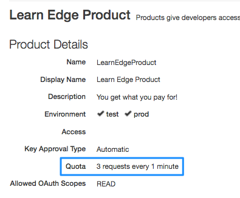

# Set a quota on the proxy

In this Learn Edge example we explore quotas. Quotas let you limit the number of API calls in a given period of time. Quotas are a commonly used feature in Edge. For example, you might offer fee-based quota levels to developers. As you'll see, you can associate quota levels with API Products. A developer might pay a higher fee to obtain an API key associated with a Product that has a higher quota. 

**Note:** If you're not sure what Products and API keys are, please try the Learn Edge example for [API Key Security](../apikey-security/README.md). 

### Prerequisites

Be sure to perform the [prerequisites](https://github.com/apigee/api-platform-samples/tree/master/learn-edge#prerequisites) if you haven't already.

### Provision the required entities

We assume you've provisioned the Product, Developer App, and Developer as explained in `apikey-security`. If you want to redo it, here's how:

1. `cd api-platform-samples/learn-edge/provisioning`.
2. `./cleanup.sh`.
3. `./setup.sh`.

### Deploy it

1. `cd api-platform-samples/learn-edge/quota-1`.
2. `./deploy.sh`

### Run it
3. `./invoke.sh`
4. The Quota policy in this example is set to allow 3 API calls per minute. Are you surprised by the output?

**Surprised?** The quota is set to 3 calls per minute. Were you surprised to see that more than 3 calls went through before the quota was exceeded? The reason is that by default, quota counters are not synchronized across Edge message processors. You can read more about [distributed counters](http://docs.apigee.com/api-services/reference/quota-policy) in the Quota policy doc. 

### Trace it

* In the UI, look at the Product called Learn Edge Product. Notice that the Quota settings in the product are set to allow 3 requests per minute. 

  

* Go to the Edge UI and run a Trace on this API. Click the Quota policy. Notice that flow variables are set to the values set in the Product.

### About what changed

* We added a Quota policy to the proxy. Hint: it is in the `apiproxy/policies` folder and it is called `EnforceQuota.xml`:

    ```xml
      <Quota name="EnforceQuota">
        <DisplayName>Enforce Quota</DisplayName>
        <Interval ref="verifyapikey.VerifyAPIKey.apiproduct.developer.quota.interval">100</Interval>
        <TimeUnit ref="verifyapikey.VerifyAPIKey.apiproduct.developer.quota.timeunit">hour</TimeUnit>
        <Allow count="20" countRef="verifyapikey.VerifyAPIKey.apiproduct.developer.quota.limit"/>
      </Quota>
    ```

  **Important to note:** In the policy, we use **flow variables** to set the values of the quota interval, time unit, and count limit. These variables are set automatically when the VerifyAPIKey policy executes. Remember that each API key has a relationship with a Product. You can see that these values are set in the Learn Edge Product in the UI, or you can see the actual Product XML file that we provisioned earlier, here: `api-proxy-samples/learn-edge/provisioning/LearnEdgeProduct.json`. The relationship between Products and API keys is extremely important in Edge. 

  The explicit values for `Interval` (100) and `TimeUnit` (hour) are applied only if the `ref` variables contain no values, for example if you set no quota on the Product itself. But because our Learn Edge Product has quota settings, those are used.

* In the `apiproxy/proxies/default.xml` file, we **attach the policy** to the ProxyEndpoint's Preflow. We place it right after the VerifyAPIKey policy. That way, we can use flow variables set by the VerifyAPIKey policy to configure the Quota policy. 

    ```xml
        <ProxyEndpoint name="default">
          <PreFlow>
            <Request>
              <Step>
                <Name>VerifyAPIKey</Name>
              </Step>
              <Step>
                <Name>EnforceQuota</Name>
              </Step>
            </Request>
          </PreFlow>
          ...
    ```

 

### Extra reading: important terms and concepts

* **Quota** policy enforces a limit on the number of API calls that can be made in an interval of time. 
* **Quota-specific flow variables** are set automatically when the Verify API Key policy executes successfully. They reflect the values set in the Product associated with an API key.


### Things to try

* Create a second API Product with different quota settings, and put the Product in a new Developer App. Then, use the API key from the app to call your API. 

### Ask the community

[](https://community.apigee.com?via=github)

---

Copyright © 2016 Apigee Corporation

Licensed under the Apache License, Version 2.0 (the "License"); you may not use
this file except in compliance with the License. You may obtain a copy
of the License at

http://www.apache.org/licenses/LICENSE-2.0

Unless required by applicable law or agreed to in writing, software
distributed under the License is distributed on an "AS IS" BASIS,
WITHOUT WARRANTIES OR CONDITIONS OF ANY KIND, either express or implied.
See the License for the specific language governing permissions and
limitations under the License.
