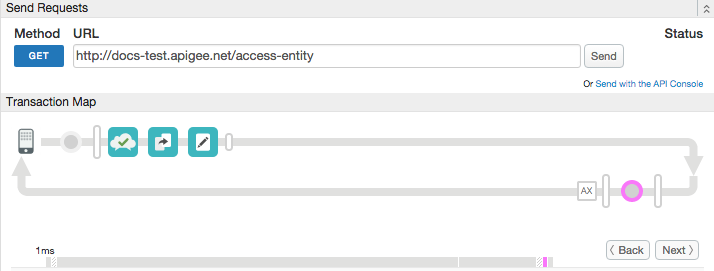

# Access Entity

### Sample use case

Retrieve profiles for Apigee Edge entities. Entities include such things as developers, developer apps, products, and more. 

### Policies 

This sample uses these policies: 

*  Access Entity: To retrieve information about a developer entity. 
*  Extract Variables: To extract the developer's email address.
*  Assign Message: To put the email address in a response header.

### About

This sample shows how to retrieve profiles for entities from the Apigee Edge datastore. Using this policy, you can retrieve profiles for things like apps, developers, and API products. Sometimes you need this information to enable dynamic behavior in policies or code running on Apigee Edge.

This example shows you how to get a developer's email address based on an API key. This works because an API key can be used to uniquely identify a developer associated with a developer app. 

The API proxy in this example does not make a request to a backend server, therefore there is no target endpoint definited. This proxy is an echo service that returns data directly from Edge.

### Quick task before you run the sample

You need to grab a valid API key from your Apigee Edge org and add it to the `invoke.sh` file. 

1. Log in to the Edge UI.
2. Select Developer Apps from the Publish menu. 
3. Select any developer app -- it doesn't matter which one, as long as it has a Consumer Key that you can copy. 
4. Click Show next to the Consumer Key for a product. 
5. Copy the Consumer Key. 
6. Open `invoke.sh` and insert the key you copied into the `KEY` variable:

    `KEY="t3AyRHIfbNJwJ6ZbBAxGmNj5YWljAeB"`

7. Save the file. 
8. Run `$ sh invoke.sh`


### Result

When you invoke this proxy, it returns an HTTP response to your terminal, shown below. Note that the response includes a custom header `X-Developer-email`. The value of this header was extracted and set dynamically on Edge. The actual email address depends on the API key you used to call the API. 

    ```
    HTTP/1.1 200 OK
    User-Agent: curl/7.37.1
    Host: docs-test.apigee.net
    Accept: */*
    X-Developer-email: tesla@weathersample.com
    Content-Length: 0
    Connection: keep-alive
    ```

### Set up, deploy, invoke

See the main project [README](../../README.md) file for information about setting up, deploying, and invoking sample proxies. 

To deploy, run `$ sh deploy.sh`

To test, run `$ sh invoke.sh`


### Trace

This screen shot from the [Apigee Edge trace tool](http://apigee.com/docs/api-services/content/using-trace-tool-0) shows the placement of the policies used in this sample. 



### More information

**Policy used in this sample**

* [Access Entity policy](http://apigee.com/docs/api-services/reference/access-entity-policy)
* [Extract Variables policy](http://apigee.com/docs/api-services/reference/extract-variables-policy)
* [Assign Message policy](http://apigee.com/docs/api-services/reference/xml-json-policy)

### Ask the community

[](https://community.apigee.com?via=github)

---

Copyright © 2016 Apigee Corporation

Licensed under the Apache License, Version 2.0 (the "License"); you may not use
this file except in compliance with the License. You may obtain a copy
of the License at

http://www.apache.org/licenses/LICENSE-2.0

Unless required by applicable law or agreed to in writing, software
distributed under the License is distributed on an "AS IS" BASIS,
WITHOUT WARRANTIES OR CONDITIONS OF ANY KIND, either express or implied.
See the License for the specific language governing permissions and
limitations under the License.
