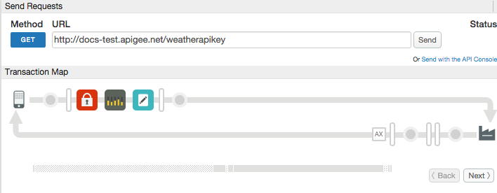

# Validate API keys and enforce quotas

### Sample use case

Validate an API key and enforce a quota based on values set in an API product.

### Policies 

This sample uses these policies: 

*  API Key: To validate an API key in the request, and populate a set of flow variables used by the Quota policy. 
*  Quota: To enforce quota on incoming requests. 
*  Assign Message: To remove the API key parameter from the request flow. 

### About

This sample demonstrates a commonly used, and often misunderstood, behavior of Apigee Edge. When you create an Edge product, you can set quota values that specify how many API calls can be made in a time period (like 10 requests per second). However, you may be surprised to find out configuring these settings do NOT actually enforce a quota!

Quotas are only enforced when a Quota policy is added to a proxy. If you specify quota values in a product, those values are used to populate flow variables that are accessible in your proxy flow, and you can then use these variables in a Quota policy.

The key to remember is that these variables are only populated under specific circumstances, and one of them is when an API key is validated. 

For example, if you have a VerifyAPIKey policy named VerifyKey, the following variables will be populated upon verification of a key with the Quota fields set as 10 requests per 1 second:

```
verifyapikey.VerifyKey.apiproduct.developer.quota.limit = 10
verifyapikey.VerifyKey.apiproduct.developer.quota.interval = 1
verifyapikey.VerifyKey.apiproduct.developer.quota.timeunit = second
```

You can then set the Quota policy like this:

```
<Quota name="CheckQuota"> 
  <Interval ref="verifyapikey.ValidateAPIKey.apiproduct.developer.quota.interval"/>
  <TimeUnit ref="verifyapikey.ValidateAPIKey.apiproduct.developer.quota.timeunit"/>
  <Allow countRef="verifyapikey.ValidateAPIKey.apiproduct.developer.quota.limit"/>
  <Identifier ref="request.queryparam.apikey"/>
</Quota>
```

This policy also has the <Identifier> element, which tells the policy to only apply the quota against calls made with the validated API key. Otherwise, all API calls will count against the quota. 

The flow of the sample goes like this:

1. A request comes in to Apigee Edge - something like this:

    `curl "http://myorg-test.apigee.net/mocktarget_key/json?apikey=abc123"``

2. A VerifyApiKey policy checks the `apikey` parameter. If it's valid, product-related flow variables are set and the call proceeds, or else an error is returned. 
3. A Quota policy executes, with quota values set based on the API key flow variables. 
4. An Assign Message policy executes to remove the `apikey` parameter from the request. Otherwise, it would be passed on to the back-end target. This step is considered a best practice. 

### Set up, deploy, invoke

See the main project [README](../../README.md) file for information about setting up, deploying, and invoking sample proxies. 

When you invoke this proxy, it returns weather information from the back-end target. The quota set in the product associated with this API key is set to allow only 1 call per minute! So, if you call it a couple of times in succession, you'll get this error:

```
{"fault":{"faultstring":"Rate limit quota violation. Quota limit  exceeded. Identifier : G8M6kx6zSnAERwvMSmmUvzXs460G7k2oN","detail":{"errorcode":"policies.ratelimit.QuotaViolation"}}}
```

### Troubleshooting

If `invoke.sh` fails, it could be because it couldn't retrieve an API key from Apigee Edge. Here's how to fix it.

To work correctly, the `invoke.sh` script assumes that these entities exist in your Edge organization:

1. A developer with the email address `thomas@weathersample.com`. 
2. A developer app called `thomas-app`. 
3. A product called `FreeProduct`. 

These entities, and several others, were added for you when your Apigee Edge org was first created. If for some reason they are missing, the `invoke.sh` script will fail. 

If you don't have these entities in your Edge organization, here are some suggestions: 

* If needed, you can provision the required entities manually with the script `api-platform-samples/setup/provisioning/setup.sh`. 

* You can edit `invoke.sh` and replace the references to `thomas@weathersample.com` and `thomas-app` with a developer and app that does exist in your org. Be sure the developer app includes a product to ensure that a valid API key is created.

### Trace

This screen shot from the [Apigee Edge trace tool](http://apigee.com/docs/api-services/content/using-trace-tool-0) shows the placement of the policies used in this sample. 

 

### More information

**Policy used in this sample**

* [Verify API Key policy](http://apigee.com/docs/api-services/reference/verify-api-key-policy)
* [Quota policy](http://apigee.com/docs/api-services/reference/quota-policy)
* [Assign Message policy](http://apigee.com/docs/api-services/reference/xml-json-policy)

**Related policies**
* [Spike Arrest policy](http://apigee.com/docs/api-services/reference/spike-arrest-policy)

### Ask the community

[](https://community.apigee.com?via=github)

---

Copyright © 2016 Apigee Corporation

Licensed under the Apache License, Version 2.0 (the "License"); you may not use
this file except in compliance with the License. You may obtain a copy
of the License at

http://www.apache.org/licenses/LICENSE-2.0

Unless required by applicable law or agreed to in writing, software
distributed under the License is distributed on an "AS IS" BASIS,
WITHOUT WARRANTIES OR CONDITIONS OF ANY KIND, either express or implied.
See the License for the specific language governing permissions and
limitations under the License.
