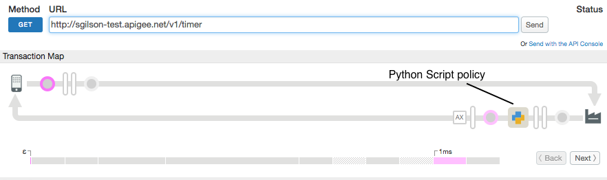

# Conditional Policy Enforcement

### Sample use case

Demonstrates conditional policy enforcement in an API proxy.

### Policies 

This sample uses this policy: 

*  Python Script: To add customized Python functionality to your API proxy.


### About

This sample demonstrates conditional policy enforcement on the Apigee API Platform.  Conditional policy enforcement enables you to execute a policy based on a condition defined on a flow.

The condition in this sample evaluates a custom HTTP header called "responsetime". When “true”, a Python script executes to populates custom response headers with metrics about the request. When "responsetime" is "false" or is omitted from the request, the Python script is bypassed and the metrics do not appear in the response.

For example, the following cURL command passes the "responsetime" header as "true": 

`curl -i -H "responsetime:true" "http://$org-$env.$api_domain/v1/timer"`

The response body always contains the string "Hello, Guest!". When "responsetime" is "true", the response also contains the headers prefixed by "X-Apigee":

```
HTTP/1.1 200 OK
Access-Control-Allow-Origin: *
Content-Type: text/plain; charset=utf-8
Date: Thu, 03 Nov 2016 13:42:18 GMT
ETag: W/"d-GHB1ZrJKk/wdVTdB/jgBsw"
Server: Apigee Router
X-Apigee-end-time: Thu, 3 Nov 2016 13:42:18 UTC
X-Apigee-end-timestamp: 1478180538275
X-Apigee-start-time: Thu, 3 Nov 2016 13:42:18 UTC
X-Apigee-start-timestamp: 1478180538088
X-Apigee-target: http://mocktarget.apigee.net
X-Apigee-target-responseTime: 187
X-Powered-By: Apigee
Content-Length: 13
Connection: keep-alive
```

For a complete list of predefined variables and instructions on constructing conditional statements with those variables, see these topics in the Apigee docs:

* [Variables reference](http://docs.apigee.com/api-services/reference/variables-reference)

* [Conditions reference](http://docs.apigee.com/api-services/reference/conditions-reference)


### Set up, deploy, invoke

See the main project [README](../../README.md) file for information about setting up, deploying, and invoking sample proxies. 

To deploy, run `$ sh deploy.sh`

To test, run `$ sh invoke.sh`


### Trace

This screen shot from the [Apigee Edge trace tool](http://apigee.com/docs/api-services/content/using-trace-tool-0) shows the placement of the policies used in this sample. 

 


### More information

Policy used in this sample

* [Python Script policy](http://docs.apigee.com/api-services/reference/python-script-policy)


### Ask the community

[](https://community.apigee.com?via=github)

---

Copyright © 2016 Apigee Corporation

Licensed under the Apache License, Version 2.0 (the "License"); you may not use
this file except in compliance with the License. You may obtain a copy
of the License at

http://www.apache.org/licenses/LICENSE-2.0

Unless required by applicable law or agreed to in writing, software
distributed under the License is distributed on an "AS IS" BASIS,
WITHOUT WARRANTIES OR CONDITIONS OF ANY KIND, either express or implied.
See the License for the specific language governing permissions and
limitations under the License.
