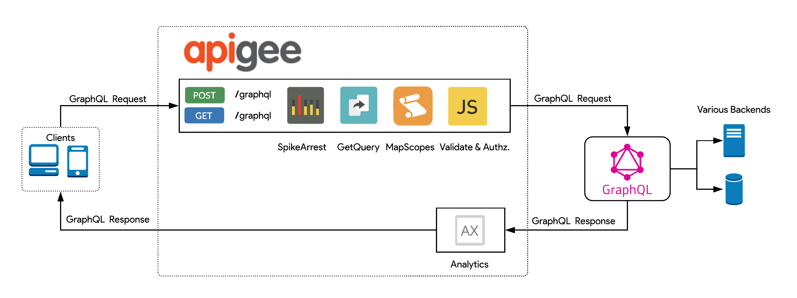
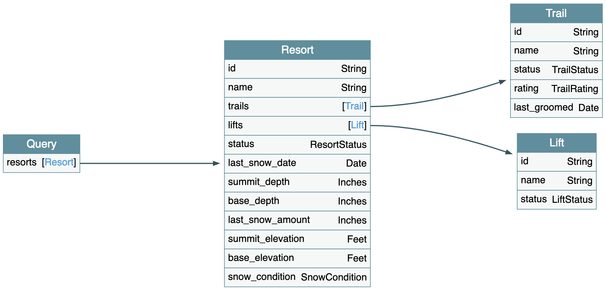
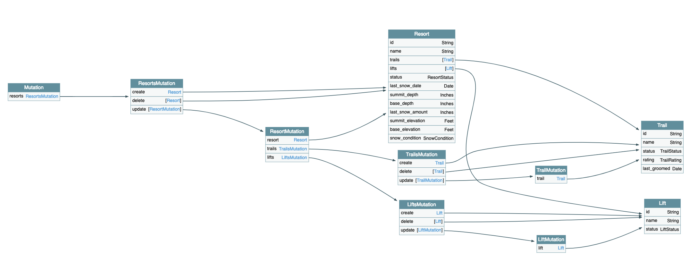
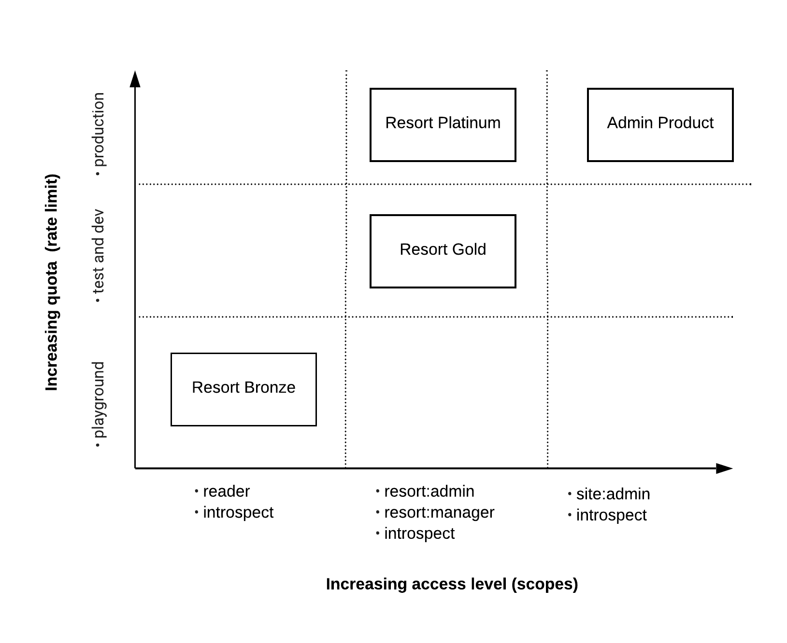
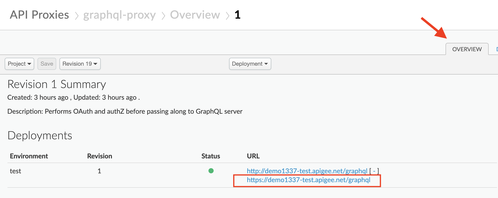
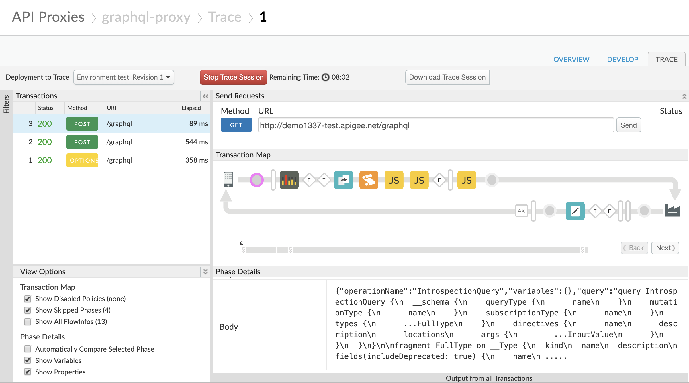
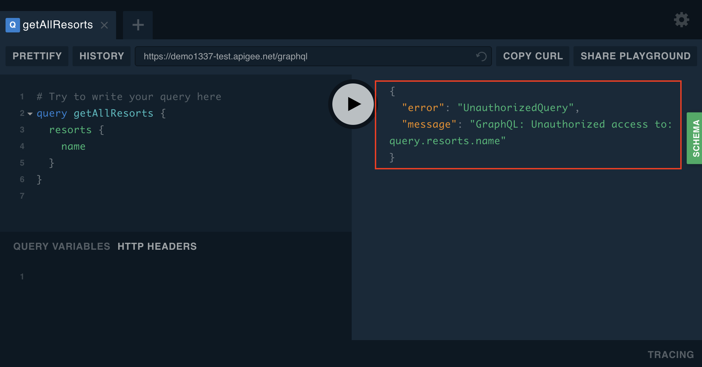
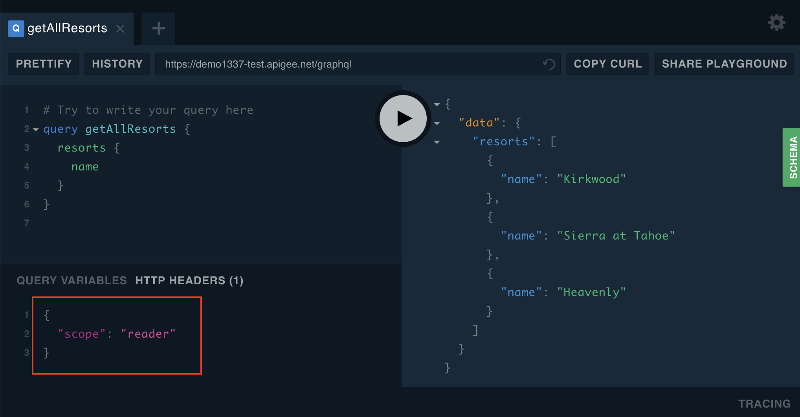

## Sample GraphQL Apigee Proxy

Table of contents
=================
<ul>
  <li><a href="#description">Description</a></li>
  <li><a href="#components">Components</a></li>
  <li><a href="#prerequisites">Prerequisites</a></li>
  <li><a href="#deploying">Deploying</a></li>
  <li><a href="#architecture">Architecture</a></li>
  <li><a href="#sample-schema">Sample schema</a></li>
  <li><a href="#design">Design</a></li>
  <li><a href="#using-graphql-playground-to-test-the-api-proxy">Using GraphQL Playground to test the API Proxy</a></li>
  <li><a href="#using-curl-to-test-the-api-proxy">Using cURL to test the API Proxy</a></li>
  <li><a href="#references">References</a></li>
</ul>

### Description

This repo contains a sample Apigee proxy that showcases how you can proxy to an existing GraphQL endpoint through Apigee Edge.

### Components

There are two components to this sample. These are `graphql-config` and `graphql-proxy`.

  1) The `graphql-config` directory contains configuration artifacts used by the sample proxy.
  2) The `graphql-proxy` directory contains the actual sample Apigee proxy bundle.

### Prerequisites
In order to configure and deploy the sample, the following are needed:

  * Apigee Edge developer account. See [docs](http://docs.apigee.com/api-services/content/creating-apigee-edge-account) for more details on how to setup your account.
  * [Java SDK >= 8](http://www.oracle.com/technetwork/java/javase/downloads/index.html)
  * [Maven 3.x](https://maven.apache.org/)

### Deploying

This repo uses both the [apigee-edge-maven-plugin](https://github.com/apigee/apigee-deploy-maven-plugin) and [apigee-config-maven-plugin
](https://github.com/apigee/apigee-config-maven-plugin) to configure and deploy the sample Apigee proxy. You don't have to install these plugins manually - Maven takes care of pulling all the necessary dependencies.


Run the following command to deploy both the `graphql-config` and `graphql-proxy` directories together.
```bash
    cd graphql-smp
    mvn install -Ptest -Dorg=<APIGEE_ORG> -Denv=<APIGEE_ENV> -Dusername=<APIGEE_USERNAME> -Dpassword=<APIGEE_PASSWORD>
```

Optionally, you can deploy each of the sub-modules independently by running the same command within the specific directory. 

e.g.

```bash
    cd graphql-smp/graphql-proxy
    mvn install -Ptest -Dorg=<APIGEE_ORG> -Denv=<APIGEE_ENV> -Dusername=<APIGEE_USERNAME> -Dpassword=<APIGEE_PASSWORD>
```

### Architecture



### Sample schema

The following demo uses this sample schema as viewed in [GraphQL Voyager](https://github.com/APIs-guru/graphql-voyager):

Query root:


Mutation root:


### Design

The sample Apigee proxy is designed to be simple, yet concise, in order to convey how you would use Apigee to proxy an existing GraphQL endpoint. In the request flow, we have included:

  1. **A SpikeArrest** policy (to smooth out the traffic and protect the GraphQL backend)
  2. **A KVM policy** to retrieve a scopes map
  3. **A JavaScript policy** to convert scopes to GraphQL entitlements
  4. **A JavaScript Callout** to validate and authorize the GraphQL query.
    
The JavaScript Callout (in step 4), uses the [graphql-js](https://github.com/graphql/graphql-js) library to parse and syntactically validate the incoming GraphQL query. Upon validation, it proceeds to list the paths that are being accessed within the GraphQL query.

For example, this query:

```
query {
  resorts {
    id,
    name
  }
}
```

Results in the following paths being accessed:

```
query.resorts.id
query.resorts.name
```

In order to authorize the query, the JavaScript callout then compares the paths that are being accessed against the paths that the client is entitled to access. For a client request to be successfully authorized, the client entitlements must contain the paths being accessed in the query.
    
This is what the configuration looks like for the JavaScript callout (in step 4)

```
<Javascript async="false" continueOnError="false" enabled="true" timeLimit="200" name="GraphQLAuthZ">
    <DisplayName>GraphQLAuthZ</DisplayName>
    <Properties>
        <Property name="input">{query}</Property>
        <Property name="entitlements">{entitlements}</Property>
        <Property name="debug">true</Property>
    </Properties>
    <ResourceURL>jsc://graphql.jsc.js</ResourceURL>
</Javascript>
```

Notice that both the `query` and `entitlements` properties are being populated from flow variables of the same name.
These flow variables are initialized earlier in the request by policies in steps 2 and 3.

For this sample Apigee proxy, we are building the client entitlements list by using a map of scopes-to-entitlements. This map is stored as a JSON object within an [Apigee KVM](https://docs.apigee.com/api-platform/cache/key-value-maps). Here is what the map looks like:

```
{
  "instrospect": [
    "query.__schema.**"
  ],
  "reader": [
    "query.__schema.**",
    "query.resorts.**"
  ],
  "site:admin": [
    "query.__schema.**",
    "query.resorts.**",
    "mutation.resorts.create.**",
    "mutation.resorts.delete.**",
    "mutation.resorts.update.**"
  ],
  "resort:admin": [
    "query.__schema.**",
    "query.resorts.**",
    "mutation.resorts.update.**",
    "mutation.resorts.update.lifts.create.**",
    "mutation.resorts.update.lifts.update.**",
    "mutation.resorts.update.lifts.delete.**",
    "mutation.resorts.update.trails.create.**",
    "mutation.resorts.update.trails.update.**",
    "mutation.resorts.update.trails.delete.**"
  ],
  "resort:manager": [
    "query.__schema.**",
    "query.resorts.**",
    "mutation.resorts.update.resort.**",
    "mutation.resorts.update.lifts.update.**",
    "mutation.resorts.update.trails.update.**"
  ]
}
```

Given the above map, if the arriving request has `reader` scope, it means that the client is entitled to execute introspection queries as well as read resorts related data. 

While it's not necessary to have a scopes-to-entitlements map, it's a practical abstraction that allows you to logically group a set of entitlements and segment access to your GraphQL schema.

Scopes are filtered at the Apigee API Product level. As an example, you could have a set Apigee API Products designed like this:



This approach plays specially well with Apigee's consumption model with OAuth, Apps, and API Products. You could enforce that subscriptions to the `GraphQL Platinum` product require approval, where as the `GraphQL Bronze` product is open to all. 

### Using GraphQL Playground to test the API Proxy

Once you have deployed the sample Apigee proxy, you can start testing it. Log into your Apigee Edge account and go to  **Develop** > **API Proxies**. In the proxies list there will be a new proxy named `graphql-proxy`. Click to open it.

Next, click on the `Develop` tab and copy the URL.



To test the sample proxy, you can use the [GraphQL playground](https://legacy.graphqlbin.com), and point it to the GraphQL endpoint above.

As soon as the GraphQL playground opens up, it sends a couple of introspection queries to the Apigee proxy.
You can open the [Apigee Trace Tool](https://docs.apigee.com/api-platform/debug/using-trace-tool-0) and refresh the playground to see the introspection query arriving.
 


Note that this proxy configured such that all requests are implicitly granted the entitlements needed to introspect the schema. That's why this first request goes through successfully.

However, if you try to send additional queries, you will see that Apigee blocks them. 
 


You have to open the **Headers** tab in the playground, and add a **scope** header.



In this example, we are passing the scope as a header manually to demonstrate the authorization logic. However, in a production scenario the scope would likely be associated with something like an OAuth bearer token or a JWT.

### Using cURL to test the API Proxy

Here is a sample cURL call
```
curl -X POST \
  https://yourorg-yourenv.apigee.net/graphql \
  -H 'Accept: application/json' \
  -H 'Content-Type: application/json' \
  -H 'scope: reader' \
  -d '{"query":"{\n  resorts {\n    name\n    lifts {\n      status\n      name\n    }\n  }\n}\n"}'
```

### References

1) [graphql-authz](https://github.com/apigee/graphql-authz) - Repo is used for building the JavaScript callout that executes the authorization logic in this sample proxy. Visit that repo to learn more about how it works.


## Not Google Product Clause

This is not an officially supported Google product.
