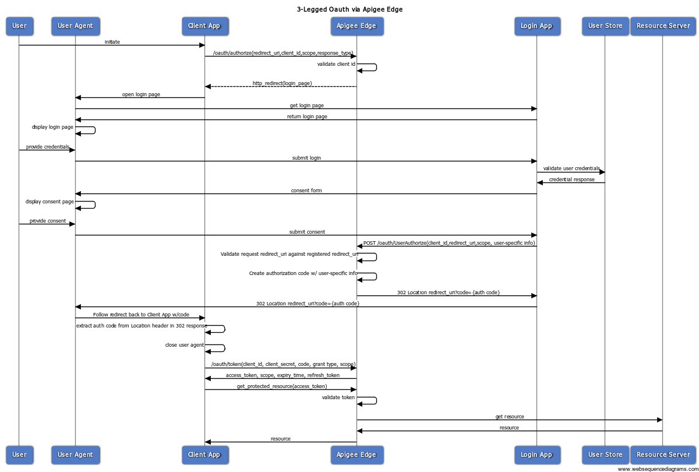

# Authorization code grant type example

This is a complete, working example that demonstrates an approach to implementing the OAuth 2.0 authorization code grant type with Apigee Edge as the authorization server.

> If you are not familiar with OAuth 2.0 and terms like grant type and authorization server, there are many resources available on the web. We recommend you start with the [IETF specification](https://tools.ietf.org/html/draft-ietf-oauth-v2-31). It includes a good, general introduction to the OAuth 2.0 framework and its use cases.

* [What you need to know about this example](#needtoknow)
* [What are the parts of this example](#parts)
* [How do I get it?](#howdo)
* [Prerequisites](#prerequisites)
* [Required configuration steps](#configuration)
* [Deploy and run the example](#deploy)
* [About login and consent session management](#session)

## <a name="needtoknow">What you need to know about this example

The authorization code grant type requires a step where the end user logs in to the resource server and then gives explicit consent for the app to user her protected resources. The key to this flow is that the client app never gets to see the user's login credentials for the protected resources.

Here's a flow diagram outlining the steps of this flow. Note that in this flow Apigee Edge serves as the authorization server (generates access tokens, etc) and the resource server (proxies APIs that are protected by OAuth security). 

**TIP:** Save the graphic to your system and open it locally to see the full size image. 



1. User initiates the flow by clicking a button in a web page. 
2. The user's browser is redirected to a login page. This login page is not under the control of the client app. The client app does not participate in the login interaction, and the client app never sees the user's username or password.
3. If login is successful, the user is directed to a consent page. The consent page allows the user to specify scopes (what the client app is authorized to do with on behalf of the user). 
4. After consent is given, the login app communicates with the authorization server. If everything is okay, the authorization server generates an authorization code and sends it back to the client app (via a previously specified redirect URI). 
5. The client app now has an authorization code and uses it to ask the authorization server for an access token. 
6. Upon receiving an access token, the client app is able to access the protected APIs on the resource server by including the access token with each call. 

## <a name="parts">What are the parts of this example

This example has the following parts:

* **login-app** -- A complete implementation that includes a login page and a consent page. Implements session management for extra security. Essentially, this is an API proxy deployed on Apigee Edge. Most of the implementation is in Node.js. For information on the session management feature, see `login-app/README`. 
* **user-mgmt-v1** -- A key/value store implementation for storing the user's login information. Implemented as an API proxy and deployed on Apigee Edge. An interface to any user management system could be plugged in here, such as LDAP. 
* **webserver-app** -- A very simple web page implemented as an API proxy (runs on Apigee Edge to simplify this example). This is the client app -- the target of the redirect URL to which tokens and other information are sent from the authorization server. Note that this client app never sees the user's login credentials for the resource server.
* **oauth2** -- An API proxy deployed on Apigee Edge that implements the OAuth 2.0 token endpoints. This is the Apigee Edge authorization server interface. Think of this as a service for requesting and managing OAuth tokens. 
* **deploy.sh** -- There's a `deploy.sh` in the example's root directory -- you can use this script to deploy all of the example apps at once. There's also a `deploy.sh` in each example app (e.g., in `./login-app`, etc) that you can use to deploy individual apps to Apigee Edge. 

>Note that all the parts of this example run on Apigee Edge. For the most part, this is just to simplify things. The login app, for example, could be designed to run on any platform, as long as it can communicate with Apigee Edge (the authorization server). Such details are obviously going to vary depending on the specific project. 


## <a name="howdo"></a>How do I get it?

#### 1) Clone this repository from Git
```bash 
  $ git clone https://github.com/apigee/api-platform-samples
```

When you have the samples repository on your system, CD to `./api-platform-samples/sample-proxies/oauth-advanced`. This puts you in the root directory of this example.

## <a name="prerequisites">Prerequisites

To run this sample, you'll need:

* The username and password that you use to login to `enterprise.apigee.com`.

* The name of the organization in which you have an account. Login to 
  `enterprise.apigee.com` and check account settings.

* A registered developer app on  Apigee Edge. You can use one of the pre-installed developer apps. 
    
    **Important!** Log in to Edge and go to **Publish > Developer Apps**. The developer app **must** include this callback URI: `https://myorg-myenv.apigee.net/web/callback`. For example:

    `https://wwitman-prod.apigee.net/web/callback`

    Also, grab the Consumer ID and Consumer Secret values for this app. You'll need them when you configure the example. 

## <a name="configuration">Required configuration steps

This is an advanced example that includes four separate API proxies that include a web app (the client app), an OAuth proxy (OAuth endpoints), a login/consent app (where a user logs in to grant the app access to protected resources), and a user management app (stores user login information). 

  >Note: Many parts of the example could be implemented differently. What is important is to understand the overall flow and what it takes to implement this grant type securely, particularly with regards to how the login app fits into the flow. 

1. CD to the root directory of the example: `./api-platform-samples/sample-proxies/oauth-advanced`.

2. Configure the **login app**:

    a. Open `login-app/apiproxy/resources/node/config/config.js`

    b. Enter your environment information. The domain will typically be `apigee.net`. Some on-premise installations of Apigee Edge may use a different domain. For example:

      ```
          exports.envInfo = {
             org: 'wwitman',
             env: 'prod',
             domain: 'apigee.net'
          };
      ```

    c. Save the file. 

3. Configure the **webserver app**: 

    a. Open `webserver-app/apiproxy/policies/SetConfigurationVariables.xml`

    b. Enter your environment information as shown below. **Important!** You'll need to grab the Consumer ID and Consumer Secret from your developer app that is registered on Apigee Edge. Substitute those values in for the `appKey` and `appSecret`. For example:

    ```xml
          <AssignMessage async="false" continueOnError="false" enabled="true" name="SetConfigurationVariables">
              <DisplayName>SetConfigurationVariables</DisplayName>
              <FaultRules/>
              <Properties/>
              <AssignVariable>
                  <Name>appKey</Name>
                  <Value>ZYzA46H8xecJKvrwoQolMGGWZzMqIr8</Value>
              </AssignVariable>
              <AssignVariable>
                  <Name>appSecret</Name>
                  <Value>h9tA9kWaTFMWwpM</Value>
              </AssignVariable>
              <AssignVariable>
                  <Name>config.environment</Name>
                  <Value>prod</Value>
              </AssignVariable>
              <AssignVariable>
                  <Name>config.organization</Name>
                  <Value>wwitman</Value>
              </AssignVariable>
              <AssignVariable>
                  <Name>config.domain</Name>
                  <Value>apigee.net</Value>
              </AssignVariable>
              <AssignVariable>
                  <Name>config.protocol</Name>
                  <Value>https</Value>
              </AssignVariable>
              <IgnoreUnresolvedVariables>false</IgnoreUnresolvedVariables>
          </AssignMessage>
    ```
   
   c. Configure the client HTML file:
      
      1. Open `webserver-app/apiproxy/policies/HTMLIndex.xml`
      
      2. Edit the `BASEURL`, `REDIRECT`, and `CLIENT_ID` variables as follows:
        
        * BASEURL - The base URL for your environment. For example: https://myorg-myenv.apigee.net. 
        * CLIENT_ID - The "Consumer Key" obtained from a developer app that is registered on Apigee Edge. **Important!** This key  must match the one you configured in the webserver app. 
        * REDIRECT - This is the Redirect URI. **Important!** This URI must *exactly match* the Callback URI that is associated with the registered developer app.  
    
    d. Save the file.

## <a name="deploy">Deploy and run the example

#### 1. Run the deploy script. 

1. CD to the root directory of the example.
2. Open `../../setup/setup.sh` and add your Apigee Edge account information. The example will be deployed to the organization specified in this file. 
2. Execute `$ sh deploy.sh`. The script imports the example into Apigee Edge. 

**TIP:** Log in to Apigee Edge to see the deployed proxies. Use the Trace tool to view details about the proxies at runtime. 

#### 2. Open a browser and go to this URL:

        `http://myorg-myenv-apigee.net/web`

For example:

        `http://jdoe-prod-apigee.net/web`

#### 3. Initiate the flow

Just click the "Login with Apigee Example Auth" button. This action sends a request to the authorization server (Apigee Edge), which redirects the browser to a login page. 

#### 4. Register and log in

In the login page, you need to register if you haven't already (click register). Then, you can log in. The browser then redirects to the consent page. 

#### 5. Give consent

The consent page gives you (the end user) a chance to limit the type of access the app will have to your resources. In this example, only one scope is offered, called "order". Click **Allow** to give the app access to your resources.

#### 6. Retrieve the access token

After you give consent, these things happen behind the scenes (refer to the flow diagram above for more a graphical view): 

1. The login app communicates to the authorization server that the login was successful.
2. The authorization server generates an authorization code and returns it to the app. 
3. The app puts the code into a request to the authorization server for an access token. The app also supplies the client ID and client secret keys.
4. The authorization server validates the auth code and other credentials, and if everything is okay, it returns an access token back to the client.
5. Now, with an access token, the client can request resources from the protected API. 

It's important to see that the app never saw the user's username and password entered in the login page. 

## <a name="session">About login and consent session management

The login app includes session management to guarantee that only the logged-in user can access the consent page. Once a successful login has occurred, a user attribute is set in the server side session data.  This attribute is checked when clients access the consent page.  A valid logged-in session can only be used one time for consent to an authorization.  The session is destroyed upon a successful consent in which an authorization code is generated for the client application. For more information, see `./login-app/README`. 

## Get help

Help or comments? See [Apigee Support](https://community.apigee.com/content/apigee-customer-support). 

Copyright © 2014 Apigee Corporation

Licensed under the Apache License, Version 2.0 (the "License"); you may not use
this file except in compliance with the License. You may obtain a copy
of the License at

http://www.apache.org/licenses/LICENSE-2.0

Unless required by applicable law or agreed to in writing, software
distributed under the License is distributed on an "AS IS" BASIS,
WITHOUT WARRANTIES OR CONDITIONS OF ANY KIND, either express or implied.
See the License for the specific language governing permissions and
limitations under the License.
