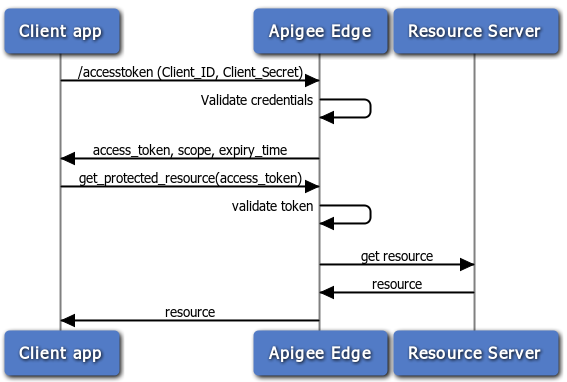

# Client credentials grant type

This sample lets you request an OAuth token from Edge using the OAuth 2.0 client credentials grant type flow. 

## About client credentials

Most typically, this grant type is used when the app is also the resource owner. For example, an app may need to access a backend cloud-based storage service to store and retrieve data that it uses to perform its work, rather than data specifically owned by the end user. This grant type flow occurs strictly between a client app and the authorization server. An end user does not participate in this grant type flow. 

## How it works

With the client credentials grant type flow, the client app requests an access token directly by providing its client ID and client secret keys. These keys are generated when you create a Developer App in Apigee Edge. Edge validates the credentials and returns an access token to the client. The client can then make secure calls to the resource server.

The API is called like this, where the client ID and secret are Base64-encoded and used in the Basic Auth header:

```
curl -H "Authorization: Basic <base64-encoded key:secret>" https://example-test.apigee.net/oauth/accesstoken?grant_type=client_credentials
```

The flow of this grant type looks like this:



## Implementation on Apigee Edge 

The client credentials sample uses one policy that executes on Apigee Edge: An OAuthV2 policy to generate the access token. The policy is attached to the `/accesstoken` endpoint (a custom flow on Apigee Edge). 

## Prerequisites

To run this sample, you'll need:

* The username and password that you use to login to `enterprise.apigee.com`.

* The name of the organization in which you have an account. Login to 
  `enterprise.apigee.com` and check account settings.

## Configure 

1. Edit this script with your environment details:

    `api-platform-samples/setup/setenv.sh`
    
2. cd to `api-platform-samples/setup/provisioning`
3. Execute this script to set up required API products, developers, and apps in your organization:

    `./setup.sh`

4. Enter your Edge password when prompted.
5. Enter the name of this sample proxy when prompted. It is `oauth-client-credentials`.

## Deploy and run the sample project

To deploy, run `$ sh deploy.sh`

To test, run `$ sh invoke.sh`

## Result

The `invoke.sh` script builds and executes the curl command shown below. The command calls the access token endpoint on Apigee Edge with the URL encoded client ID and client secret keys sent in the Authorization header. 

````sh
curl -H "Authorization: Basic <base64-encoded key:secret>" https://example-test.apigee.net/oauth/accesstoken?grant_type=client_credentials 

AccessToken Response: 
 {
  "issued_at" : "1416157639014",
  "application_name" : "e49ef95f-6d32-4062-ac9a-3beea62ca922",
  "scope" : "",
  "status" : "approved",
  "api_product_list" : "[Test App product]",
  "expires_in" : "3599",
  "developer.email" : "testdev@example.com",
  "organization_id" : "0",
  "token_type" : "BearerToken",
  "client_id" : "kWocGgKENrdWRT0jq4l0F0ACnPAQsD3",
  "access_token" : "WNSnwquKualbgnGeAK0EXGqzO3A",
  "organization_name" : "example",
  "refresh_token_expires_in" : "0",
  "refresh_count" : "0"
}
````

## Ask the community

[](https://community.apigee.com?via=github)

---

Copyright © 2016 Apigee Corporation

Licensed under the Apache License, Version 2.0 (the "License"); you may not use
this file except in compliance with the License. You may obtain a copy
of the License at

http://www.apache.org/licenses/LICENSE-2.0

Unless required by applicable law or agreed to in writing, software
distributed under the License is distributed on an "AS IS" BASIS,
WITHOUT WARRANTIES OR CONDITIONS OF ANY KIND, either express or implied.
