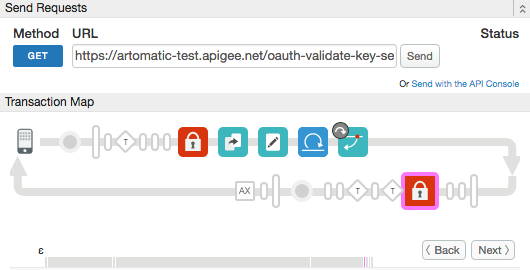

# Validate both client secret and key

### Sample use case

You are implementing the OAuth Password grant type flow. You need to validate both the application client key and secret on Edge before calling an outside Identity Provider to validate the user's credentials.   

### Policies 

This sample uses several policies in concert. The flow goes like this:

1. [OAuthV2](http://docs.apigee.com/api-services/content/oauthv2-policy) -- Validates the incoming key and secret. The policy is configured to do the validation without storing the generated access token in the token store. Instead, it is saved in a flow variable called apigee.access_token. If the key/secret are invalid, the policy returns an error to the client. 

    `<StoreToken>false</StoreToken>`

2. [Extract Variables](http://docs.apigee.com/api-services/reference/extract-variables-policy) -- Extracts form parameters from the request (username, password, and grant type) and stores them in variables for later use.
3. [Assign Message](http://docs.apigee.com/api-services/reference/assign-message-policy) -- Builds a request message to call the external Identity Provider. Uses saved variables.
4. [Service Callout](http://docs.apigee.com/api-services/reference/service-callout-policy) -- Calls the Identity Provider to validate user credentials. The sample uses API BaaS to validate the credentials. 
5. [Raise Fault](http://docs.apigee.com/api-services/reference/raise-fault-policy) -- Returns a "401" message to the client if user validation fails.
6. [OAuthV2](http://docs.apigee.com/api-services/content/oauthv2-policy) -- Generates the access token using the access token generated previously as an "external token". Although the token was not stored in Edge's token store, it was stored in a flow variable, which we can now access as an externally-generated token in the <ExternalAccessToken> element. This pattern takes the "externally generated" token, stores it in the token store, and returns it to the client. The client can now make API calls with the token. 

```
    <OAuthV2 async="false" continueOnError="false" enabled="true" name="OA-GenerateAccessToken-Password">
        <DisplayName>OA-GenerateAccessToken Password</DisplayName>
        <Operation>GenerateAccessToken</Operation>
        <ExternalAccessToken>apigee.access_token</ExternalAccessToken>
        <!-- This is in millseconds, so expire in an hour -->
        <ExpiresIn>36000000</ExpiresIn>
        <SupportedGrantTypes>
            <GrantType>password</GrantType>
        </SupportedGrantTypes>
        <GrantType>request.formparam.grant_type</GrantType>
        <UserName>request.formparam.username</UserName>
        <PassWord>request.formparam.password</PassWord>
        <GenerateResponse enabled="true"/>
        <GenerateErrorResponse enabled="true"/>
    </OAuthV2>
```
 

### When to use this pattern

You can use this pattern when you have a requirement to validate both the client ID and secret before performing other functions in the proxy flow. In this case, you want to prevent unauthorized clients from calling the Identity Provider service. If the key/secret are not valid, processing stops and an error is returned to the client.  

This sample illustrates one possible technique for validating both client and secret. This sample was inspired by [this thread](https://community.apigee.com/questions/20774/validating-both-client-id-and-secret.html) on the Apigee Community. And here is [another related community thread](https://community.apigee.com/questions/19248/can-you-validate-client-key-and-secret-without-gen.html). Both of these threads discuss alternative techniques for accomplishing this sample's use case. 

### Set up, deploy, invoke

1. Edit the `api-platform-samples/setup/setenv.sh` file to reflect your Apigee Edge organization and environment. 
1. Deploy the API proxy. You can use the `deploy.sh` script, or simply import the ZIP file through the Edge UI.
2. Execute the `api-platform-samples/setup/provisioning/setup.sh` script. It deploys products and developer apps to Edge. These entities are required for this sample to run. Be sure to enter the name of the proxy when prompted: `oauth-validate-key-secret`.
3. Call the API. You can use the `invoke.sh` script. 

### Result

An access token and refresh token are returned to the client. 

```
    {
      "issued_at": "1461170770924",
      "scope": "",
      "application_name": "a021996f-36fe-4cdf-b14e-9d9262db640e",
      "refresh_token_issued_at": "1461170770924",
      "status": "approved",
      "refresh_token_status": "approved",
      "api_product_list": "[sample-product]",
      "expires_in": "35999",
      "developer.email": "tesla@weathersample.com",
      "token_type": "BearerToken",
      "refresh_token": "AE4Yzr2JVwh1WCWz7HX65BBulR7yBOV",
      "client_id": "hXLaG8ZLv7mNdTHscCIrAlqmKgvmKUo",
      "access_token": "FOmCPxsonxvLQCGEoP3K9whrlPy0",
      "organization_name": "artomatic",
      "refresh_token_expires_in": "0",
      "refresh_count": "0"
    }
```

### Trace

This screen shot from the [Apigee Edge trace tool](http://apigee.com/docs/api-services/content/using-trace-tool-0) shows the placement of the policies used in this sample. 



### More information

* [Using third-party OAuth tokens](http://docs.apigee.com/api-services/content/use-third-party-oauth-system)


### Ask the community

[](https://community.apigee.com?via=github)

---

Copyright © 2016 Apigee Corporation

Licensed under the Apache License, Version 2.0 (the "License"); you may not use
this file except in compliance with the License. You may obtain a copy
of the License at

http://www.apache.org/licenses/LICENSE-2.0

Unless required by applicable law or agreed to in writing, software
distributed under the License is distributed on an "AS IS" BASIS,
WITHOUT WARRANTIES OR CONDITIONS OF ANY KIND, either express or implied.
See the License for the specific language governing permissions and
limitations under the License.
