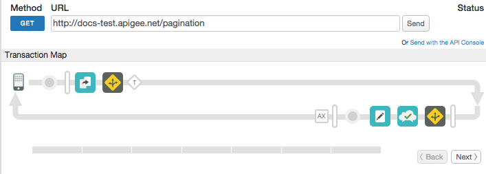

# Pagination and caching sample


### Sample use case

Paginate a cached response using XSLT.

> Note that if you create the proxies by manually deploying the `pagination.zip` and `restaurant_locator_target.zip` files in your organization, you'll need to manually create an environment cache called `paginationCache`, as described in the [Apigee documentation](http://docs.apigee.com/api-services/content/manage-caches-environment#creatingandeditingcaches).

### Policies

This sample uses these policies:

*  XSL Transform: To apply an XSLT stylesheet to the response body. The stylesheet extracts specified elements and applies `offset` and `limit` parameters.
*  Extract Variables: To extract query parameters from the request.
*  Response Cache: To cache the response from the backend service.
*  Assign Message: To set the paginated payload in the response.


### About

This sample involves 2 API proxies: `restaurant_locator` and `pagination`.

`restaurant_locator` serves as a local target (using [API proxy chaining](http://docs.apigee.com/api-services/content/connecting-proxies-other-proxies)) that returns a list of restaurants in XML.

The `pagination` proxy calls `restaurant_locator`, caches the response, and uses XSLT to return only a subset of restaurants. The list of restaurants that are returned is controlled by two query parameters you'll provide in the request: `limit` and `offset`.

* `limit` - Defines how many results to return. For example, `2` means return only 2 restaurants.
* `offset` - Defines the starting point for returned results. For example, an offset of `3` indicates that the results should begin with the 3rd restaurant in the list.

While you can use the `invoke.sh` script to make the call, here's a sample cURL request:

```
curl -v http://{org}-{env}.apigee.net/pagination?"offset=1&limit=2"
```

Use of the Response Cache policy illustrates a common pattern in API proxy design for improving API performance.

Some benefits of this technique include:

* You don't need to do pagination of the results in the app running on a mobile device.
* You don't need to implement pagination in your backend service.
* Response caching improves performance.


## XSLT Stylesheet

This is the XSL stylesheet used in this example:

```
<xsl:stylesheet xmlns:xsl="http://www.w3.org/1999/XSL/Transform" version="1.0">
        <xsl:output method="xml" version="1.0" encoding="UTF-8" />
        <xsl:param name="offset" select="offset"/>
        <xsl:param name="limit" select="limit"/>
        <xsl:template match="/">
            <Restaurants>
                <xsl:for-each select="/RestaurantLocator/Restaurant">
                 <xsl:if test="position() &lt; number($limit+$offset) and position() &gt; number($offset)-1">
                     <xsl:copy-of select="."/>
                 </xsl:if>
                   </xsl:for-each>
           </Restaurants>
        </xsl:template>
</xsl:stylesheet>
```


### Set up, deploy, invoke

See the main project [README](../../README.md) file for information about setting up, deploying, and invoking sample proxies.

### Trace

This screen shot from the [Apigee Edge trace tool](http://apigee.com/docs/api-services/content/using-trace-tool-0) shows the placement of the policies used in this sample.



### More information

**Policy used in this sample**

* [XSL Transform policy](http://apigee.com/docs/api-services/reference/xsl-transform-policy)
* [Assign Message policy](http://apigee.com/docs/api-services/reference/xml-json-policy)
* [Response Cache policy](http://apigee.com/docs/api-services/reference/response-cache-policy)
* [Extract Variables policy](http://apigee.com/docs/api-services/reference/extract-variables-policy)


### Ask the community

[](https://community.apigee.com?via=github)

---

Copyright © 2017 Google

Licensed under the Apache License, Version 2.0 (the "License"); you may not use
this file except in compliance with the License. You may obtain a copy
of the License at

http://www.apache.org/licenses/LICENSE-2.0

Unless required by applicable law or agreed to in writing, software
distributed under the License is distributed on an "AS IS" BASIS,
WITHOUT WARRANTIES OR CONDITIONS OF ANY KIND, either express or implied.
See the License for the specific language governing permissions and
limitations under the License.
