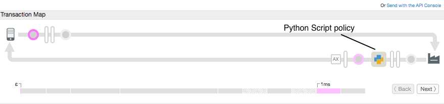

# Python Script Sample

### Sample use case

Execute a Python script in an API flow. 

### Policies 

This sample uses this policy: 

*  Python Script: To set response headers. The policy is set on the target response flow.
 

### About

>Note: This policy is not available with Apigee Edge Free (free, non-expiring license). See [Apigee Edge Pricing Features](http://apigee.com/about/pricing/apigee-edge-pricing-features). To enable this policy in your environment, contact [Apigee Support](https://community.apigee.com/content/apigee-customer-support).

This simple example executes a Python script that adds a response header to the API response. The proxy calls an API that returns XML data about a user:

```
<root>
    <city>San Jose</city>
    <firstName>John</firstName>
    <lastName>Doe</lastName>
    <state>CA</state>
</root>
```


The Python script just sets a response header named **X-Apigee-Demo-target** to the response that contained the URL of the backend service:

```
HTTP/1.1 200 OK
Access-Control-Allow-Origin: *
Content-Type: application/xml; charset=utf-8
Date: Mon, 05 Dec 2016 15:20:57 GMT
ETag: W/"8d-/7TqkgBKcDi8Ug3uWWUJpw"
Server: Apigee Router
X-Apigee-Demo-target: http://mocktarget.apigee.net/xml
X-Powered-By: Apigee
Content-Length: 141
Connection: keep-alive
```

The Python script is shown below. The Python scripts accesses a [flow variable](http://docs.apigee.com/api-services/content/introduction-flow-variables) named `target.url` that contains the URL of the target endpoint:

Note that the output of the printf statement does not get added to the response:

 ```
response.setVariable("header.X-Apigee-Demo-target", flow.getVariable("target.url"));
print 'Reached the script & assigned header variable' 
```


### Set up, deploy, invoke

See the main project [README](../../README.md) file for information about setting up, deploying, and invoking sample proxies. 

To deploy, run `$ sh deploy.sh`

To test, run `$ sh invoke.sh`


### Trace
This screen shot from the [Apigee Edge trace tool](http://apigee.com/docs/api-services/content/using-trace-tool-0) shows the placement of the policies used in this sample. 

 


### More information

**Policies used in this sample**

* [Python Script policy](http://apigee.com/docs/api-services/reference/python-script-policy)
* [Flow variables](http://docs.apigee.com/api-services/content/introduction-flow-variables)

### Ask the community

[](https://community.apigee.com?via=github)

---

Copyright © 2016 Apigee Corporation

Licensed under the Apache License, Version 2.0 (the "License"); you may not use
this file except in compliance with the License. You may obtain a copy
of the License at

http://www.apache.org/licenses/LICENSE-2.0

Unless required by applicable law or agreed to in writing, software
distributed under the License is distributed on an "AS IS" BASIS,
WITHOUT WARRANTIES OR CONDITIONS OF ANY KIND, either express or implied.
See the License for the specific language governing permissions and
limitations under the License.
