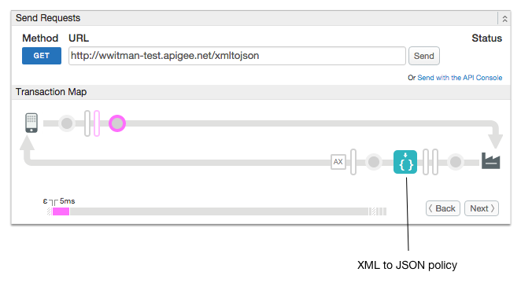

# HTTP Streaming

### Sample use case

Configure an API proxy for HTTP streaming. 

### About

By default, HTTP request and response payloads that pass through Apigee Edge are stored in a buffer, and policies that can operate on the payload work as expected. In cases where the payloads are larger than the buffer size (10 MB in Apigee Cloud, 3 MB in Edge for Private Cloud), you can set this attribute to true. When true, HTTP request payloads are not read into a buffer; they are streamed as-is to the target endpoint. In this case, any policies that operate on the payload in the TargetEndpoint request flow are bypassed.

In the default configuration, HTTP processing on the API Platform is 
asynchronous and non-blocking. 

While processing HTTP messages, the Apigee gateway does not need to:

- Allocate a single thread per request message
- Block threads while waiting for I/O

Thus, in the default configuration, the API Platform supports AJAX 
and long-polling with no additional configuration.

However, when developing apps that rely on architectures like Comet, 
you need to explicitly configure HTTP streaming, as is demonstrated by 
this sample API proxy.

**Caution**: While streaming can help you work around the request/response size limit enforced by the product, Apigee doesn't recommend exceeding that limit when streaming and can't support issues that arise as a result of exceeding that limit, such as performance issues, timeouts, and so on. For payloads larger than 10 MB, Apigee recommends using a signed URLs pattern within an Apigee JavaCallout, illustrated by the [Edge Callout: Signed URL Generator](https://github.com/DinoChiesa/ApigeeEdge-Java-GoogleUrlSigner) example.

### Set up, deploy, invoke

See the main project [README](../../README.md) file for information about setting up, deploying, and invoking sample proxies. 

### Trace

This screen shot from the [Apigee Edge trace tool](http://apigee.com/docs/api-services/content/using-trace-tool-0) shows the placement of the policies used in this sample. 

### More information

**Policy used in this sample**
* [XML to JSON policy](http://apigee.com/docs/api-services/reference/xml-json-policy)

**Related information**
* [Streaming requests and responses](http://apigee.com/docs/api-services/content/enabling-streaming)
* [Endpoint properties reference](http://apigee.com/docs/enterprise/content/endpoint-properties-reference)

### Ask the community

---

Copyright © 2015 Apigee Corporation

Licensed under the Apache License, Version 2.0 (the "License"); you may not use
this file except in compliance with the License. You may obtain a copy
of the License at

http://www.apache.org/licenses/LICENSE-2.0

Unless required by applicable law or agreed to in writing, software
distributed under the License is distributed on an "AS IS" BASIS,
WITHOUT WARRANTIES OR CONDITIONS OF ANY KIND, either express or implied.
See the License for the specific language governing permissions and
limitations under the License.