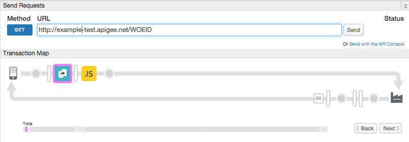

# Rerouting a target URL

### Sample use case

Rewrite a target URL dynamically on Apigee Edge.

### Policies 

This sample uses these policies: 

*  Extract Variables: To extract part of the request path into a variable. 
*  JavaScript: Rewrites the target URL. 
 

### About

This sample API proxy illustrates how to change the target endpoint URL using a JavaScript policy to set the `target.url` flow variable. This variable holds the complete URL for the back-end target endpoint, including any query parameters.  

1. Deploy the proxy. 
1. Send this request to Apigee Edge. 

    **Note:** The proxy is configured with a base path of `/zip`. The incoming request must contain that base path or the request will not be processed. Tip: Take a look at the `apiproxy/proxies/default.xml` to see where this base path is configured.

    `curl http://myorg-test.apigee.net/zip/80301`

2. An [Extract Variables policy](http://apigee.com/docs/api-services/reference/extract-variables-policy) extracts the part of the path that comes after the `/zip` base path. 

3. The policy stores the value of the zip code in a flow variable called `LOCATION.zip`. This value is specific to the back-end API. It identifies the locale for which to return geographical data. Here is the policy XML:

    ```xml
    <ExtractVariables name="extractZip">
        <DisplayName>getZipfromPath</DisplayName>
        <URIPath>
            <Pattern ignoreCase="true">/{zip}</Pattern>
        </URIPath>
        <IgnoreUnresolvedVariables>false</IgnoreUnresolvedVariables>
        <VariablePrefix>LOCATION</VariablePrefix>
    </ExtractVariables>
    ```


4. A [JavaScript policy](http://apigee.com/docs/api-services/reference/javascript-policy) rewrites the target URL by setting the `target.url` flow variable. This expression also appends the `LOCATION.zip` value to the query parameter `address`.

    `context.setVariable("target.url", "http://maps.googleapis.com/maps/api/geocode/json?address="+context.getVariable("LOCATION.zip"));`

5. Finally, the newly formed target request is sent to the backend target, the Google maps API, and the geographical information for the specified zip code is returned. 

### Set up, deploy, invoke

See the main project [README](../../README.md) file for information about setting up, deploying, and invoking sample proxies. 

### Trace

This screen shot from the [Apigee Edge trace tool](http://apigee.com/docs/api-services/content/using-trace-tool-0) shows the placement of the policies used in this sample. 



### More information

**Policies used in this sample**

* [Extract Variables policy](http://apigee.com/docs/api-services/reference/extract-variables-policy)

* [JavaScript policy](http://apigee.com/docs/api-services/reference/javascript-policy)

**Related information**
* [Apigee JavaScript Object Model](http://apigee.com/docs/api-services/reference/javascript-object-model)

### Ask the community

[](https://community.apigee.com?via=github)

---

Copyright © 2017 Apigee Corporation

Licensed under the Apache License, Version 2.0 (the "License"); you may not use
this file except in compliance with the License. You may obtain a copy
of the License at

http://www.apache.org/licenses/LICENSE-2.0

Unless required by applicable law or agreed to in writing, software
distributed under the License is distributed on an "AS IS" BASIS,
WITHOUT WARRANTIES OR CONDITIONS OF ANY KIND, either express or implied.
See the License for the specific language governing permissions and
limitations under the License.

