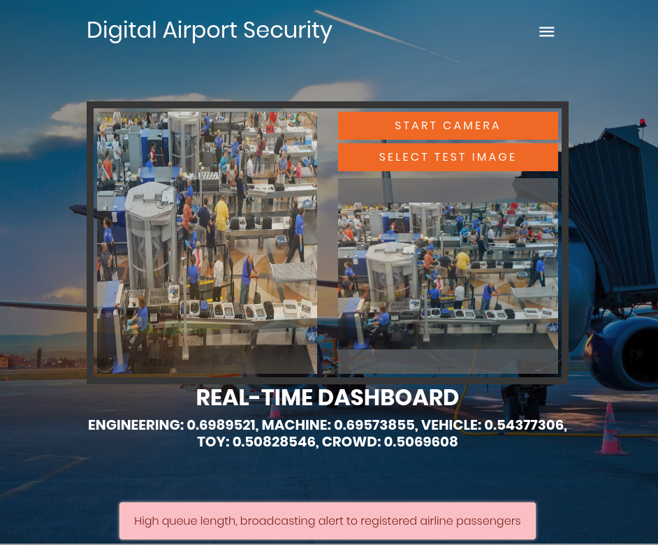
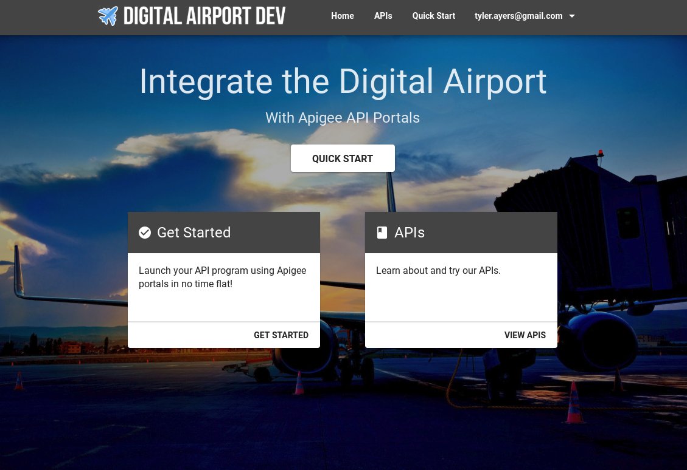
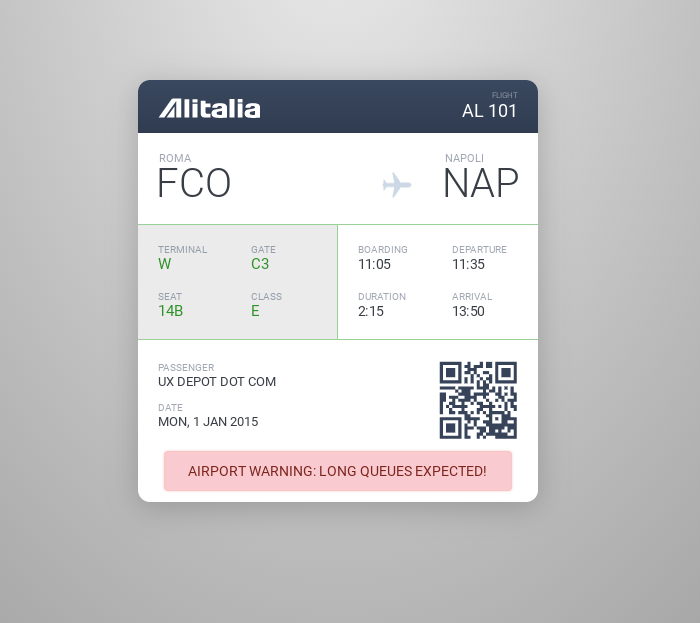
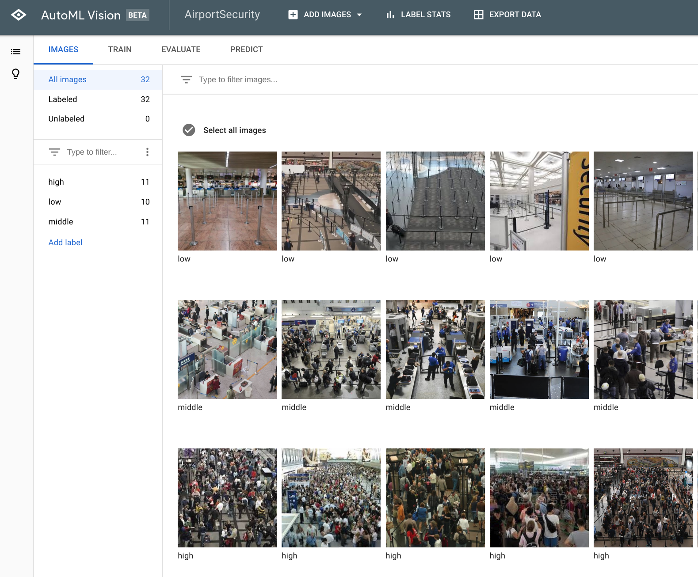
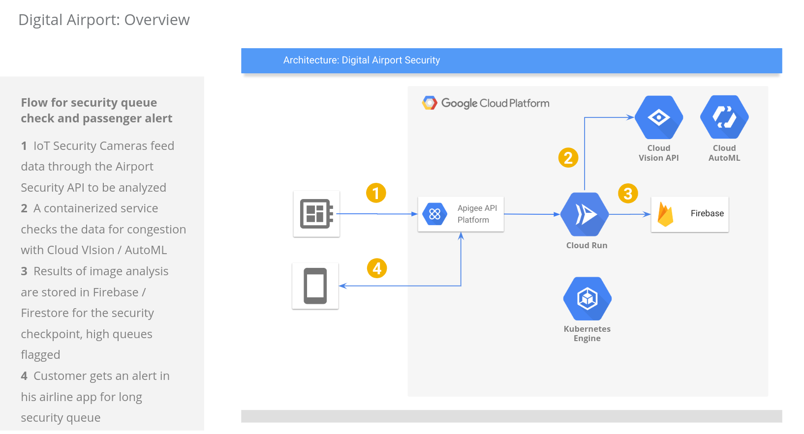

# Digital Airport
This is a demo of digital airport APIs, services, and applications to greatly improve customer experience and efficiency.  Built using Google Cloud, Firebase, and Apigee.  Basically the flow is that a camera monitors the security area of an airport, recognizes congestion and long queues using the Google Vision API / Google AutoML Vision, and if high queues are recognized sends an alert to an airline app to show the alert on the customer's boarding card, and also broadcast a notifcation.

## Components

[Digital Airport Security App](https://airport-security.web.app)

This app monitors security camera footage for crowds build-up, and in case a crowd is recognized through the *security/vision* API, then accordingly sent to the *security/checkpoint/id/status* API.

[Digital Airport Developer Portal](https://tyayers-eval-airportdeveloperportal.apigee.io/)

The Digital Airport Developer Portal serves as integration hub for all apps & services, and includes the security checkpoint API documentation.

[Airline Customer App](https://airport-security.web.app/airline-app.html)

The Airline Customer App is a sample app of how the security checkpoint API could be integrated by an airline to provide live, real-time queue updates directly on the boarding app, as well as notifications to make sure the traveller gets to the airport on time.

## Demo Guide
1. *Explain the problem:* Travellers have limited visibility about congestion problems at airports, so introducing an automated crowd monitoring solution can help alert travellers and staff to congestion in the security queue lines, and help travellers prepare for their trip to the airport, and avoid missing the flights.
2. *Show the solution:* The Digital Airport Security app monitors the airport queue footage for congestion using the Google Cloud Vision API or the Google AutoML Vision API.  Changes are posted to the Digital Airport API.
3. *Show the integration strategy:* The Digital Airport Developer Portal is the integration point both for the security solution to post crowd updates, and also for the airline apps to integrate the data to display alerts in their borading apps.
4. *Demonstrate:* Have both web pages open side-by-side in browser windows, and select a low-congestion photo.  Then select a high-congestion photo, and see how the crowd recognition data is sent to the Digital Airport API, and the alert activated in the airline boarding app.
5. *Demonstarate:* An advanced solution can also use the Google AutoML Vision service to traing crowd recognition on cusom datasets, to even further improve accuracy.

## Architecture
 

## Deployment

### Frontends

1. Create a Firebase project at firebase.google.com
2. Clone this repository, install the Firebase Tools and call 'firebase init' in the root directory to link to your firebase project.
3. Test by calling 'firebase serve' to host locally and test.  Even if you don't have the keys above set, you can still test in 'Demo Mode' with test data locally in the app (Demo Mode can be accessed by clicking on the Menu button, and going to Settings).

### Backend

Note: The backend service in the Knative directory can be deployed to any container host, the instructions below are for deploying to [Google Cloud Run](https://cloud.google.com/run/).

1. Build and push the container in the Knative directory to [Google Container Registry](https://cloud.google.com/container-registry/docs/pushing-and-pulling#pushing_an_image_to_a_registry).  If you want to use a custom AutoML Vision dataset for image recognition, then you must also configure a privatekey under privatekey.json in the knative directory.
2. Deploy the pushed container to [Cloud Run](https://cloud.google.com/run/docs/deploying#service)
3. Configure the environment variables VISIONKEY with your Google Cloud Vision API key, FBKEY with your Firebase database access key, FBPROJECT with your Firebase project name, and the key FBDOMAIN with the root domain of your Firebase project. The keys are used to access the Firestore database, so fore more information on which keys are needed see docs here: [Firestore Getting Started](https://firebase.google.com/docs/firestore/quickstart#initialize)
4. Configure the Cloud Run service URL as the target endpoint in your Apigee API Proxy.

*Coming Soon: apigee proxy configuraiton also here in the repository.*